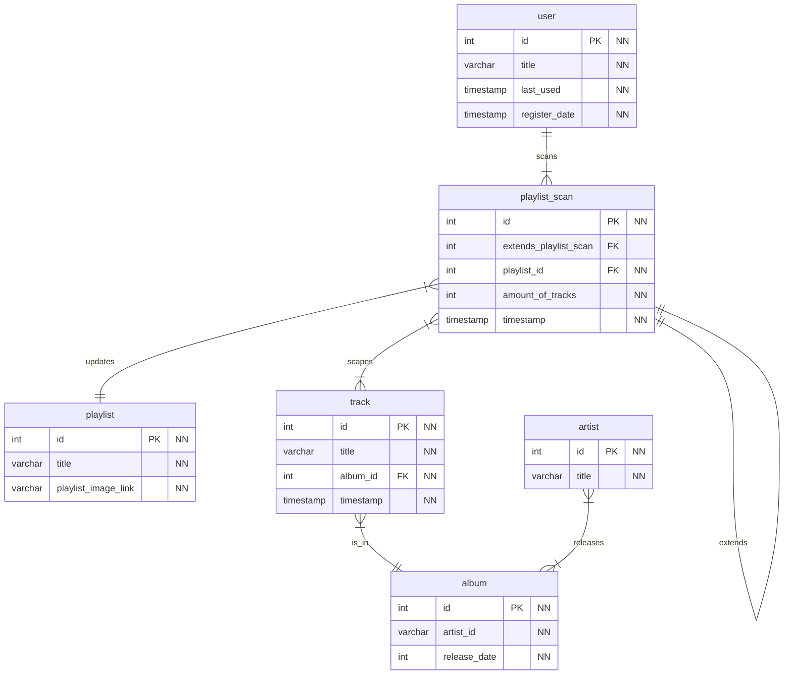

# Mixster
A open-source spin on the interactive music card game: Hitster

### Setup:

1. Create a .env file


2. Update the .env file:

   ```python
   #Spotify config
   SPOTIFY_CALLBACK_URL='http://127.0.0.1:5050/auth/callback' # Or some other FQDN you configured
   SPOTIFY_CLIENT_ID='<my_spotify_client_id>'
   SPOTIFY_CLIENT_SECRET='<my_spotify_client_secret>'
   
   # MariaDB config
   MYSQL_ROOT_PASSWORD='<my_password>' # Chose any password
   MYSQL_DATABASE_NAME="mixster"
   MYSQL_USER_NAME="mixster_user"
   MYSQL_USER_PASSWORD='<my_password>' # Chose any password
   ```
   
   > Spotify's credentials can be acquired from the [Spotify Developer Dashboard](https://developer.spotify.com/dashboard)

   Replacing all strings beginning with `<my_>` with your own
   

3. Run command `docker compose up -d`


4. navigate to the flask endpoint (default: http://127.0.0.1:5050/)

### Database / Datastorage:

Almost all information is scraped by the public spotify web interface but to account for playlist change there is also some data storage so a entry can be relinked to a specific scan in time

**ERD**:

