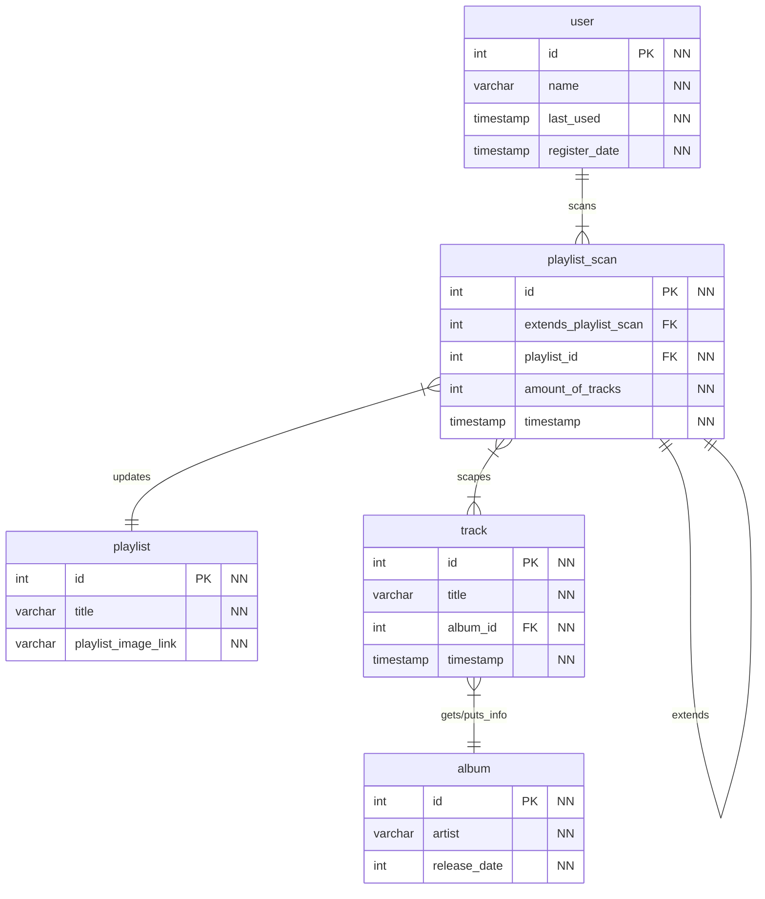

# Mixster
A open-source spin on the interactive music card game: Hitster

### Setup:

1. Setup [This](#database--datastorage) Database


2. Create a new file: `/spotify/api/secret.py` containing:

    ```python
    SPOTIFY_CLIENT_ID = 'MY_SPOTIFY_CLIENT_ID'
    SPOTIFY_CLIENT_SECRET = 'MY_SPOTIFY_CLIENT_SECRET'
   
    mysql_credenticals = {
        'host': 'MY_HOST', # localhost for most
        'database': 'MY_DATABASE',
        'user': 'MY_DATABASE_USER',
        'password': 'MY_DATABASE_USER_PASSWORD'
   }
   ```
   > Spotify credentials can be acquired from the [Spotify Developer Dashboard](https://developer.spotify.com/dashboard)

   Replacing all strings beginning with `MY_` with your own
   

3. Run flask.py


4. navigate to the flask endpoint (default: http://127.0.0.1:5000/)

### Database / Datastorage:

Almost all information is scraped by the public spotify web interface but to account for playlist change there is also some data storage so a entry can be relinked to a specific scan in time

**ERD**:

